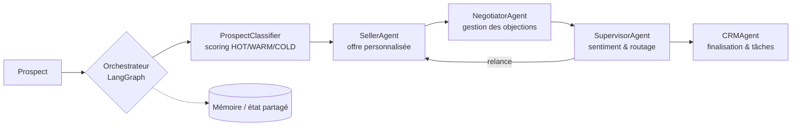

# AgenticSellerPOC

[](https://github.com/suaniafluence/AgenticSellerPOC/actions)
[](https://codecov.io/gh/suaniafluence/AgenticSellerPOC)
[](https://www.python.org/downloads/)
[](https://opensource.org/licenses/MIT)

> Multi-agent B2B sales platform — LangGraph · FastAPI · OpenAI/Anthropic · Docker · CI/CD



## Description

**AgenticSellerPOC** est une plateforme d'automatisation commerciale B2B propulsée par l'IA, conçue pour **IAfluence**, cabinet de conseil spécialisé en stratégie IA et gouvernance pour les PME et ETI.

Le système utilise une **architecture multi-agents orchestrée par LangGraph** avec un orchestrateur centralisé pour gérer intelligemment l'ensemble du cycle de vente :

### Fonctionnement

```
Prospect → [Orchestrateur LangGraph] → Classification → Offre personnalisée → Négociation → Finalisation CRM
```

1. **ProspectClassifier** : Qualifie et score les leads (HOT/WARM/COLD), identifie le secteur, la taille d'entreprise, la maturité IA et les pain points
2. **SellerAgent** : Génère des offres commerciales personnalisées parmi 5 packages de services (Diagnostic, Stratégie IA & Gouvernance, Formation, Expertise Technique & POC, Accompagnement Global)
3. **NegotiatorAgent** : Gère les objections (budget, timing, autorité, confiance, concurrence, technique) et ajuste les offres dans les limites autorisées
4. **SupervisorAgent** : Analyse le sentiment, calcule la probabilité de conversion et route stratégiquement la conversation
5. **CRMAgent** : Finalise les sessions, crée les enregistrements CRM et génère les tâches pour l'équipe commerciale

### Principales capacités

- Orchestration multi-agents avec routage centralisé intelligent via LangGraph
- Qualification automatique des prospects avec scoring multi-dimensionnel (0-100)
- Génération d'offres adaptées au profil et au budget du prospect
- Gestion automatisée des objections avec stratégies de négociation (remises, facilités de paiement, alternatives)
- Interface web de monitoring avec dashboard, logs temps réel et configuration dynamique
- API REST complète avec authentification Google OAuth 2.0
- Support multi-LLM (OpenAI GPT-4, Anthropic Claude)
- 10 scénarios de vente prédéfinis pour les tests et démonstrations
- Mémoire conversationnelle et analytique (InMemory / JSONFile)

## Stack technique

- **Orchestration IA** : LangGraph, LangChain, OpenAI, Anthropic
- **Backend** : FastAPI, Uvicorn, Pydantic
- **Frontend** : Jinja2, HTML/CSS/JS
- **Données** : SQLite (aiosqlite), Redis (optionnel), Qdrant (optionnel)
- **Tests** : pytest, pytest-asyncio, pytest-cov
- **Qualité** : Black, Ruff, isort, mypy, Bandit
- **CI/CD** : GitHub Actions, Docker, CodeQL
- **Python** : 3.9+

## Installation

### Using pip

```bash
pip install agenticsellerpoc
```

### From source

```bash
git clone https://github.com/suaniafluence/AgenticSellerPOC.git
cd AgenticSellerPOC
pip install -r requirements.txt
pip install -e .
```

### Using Docker

```bash
cp .env.example .env   # renseigner les clés API (OPENAI_API_KEY, GOOGLE_CLIENT_ID, etc.)
docker build -t agenticsellerpoc .
docker run --env-file .env -p 8000:8000 agenticsellerpoc
```

## Development

### Setup Development Environment

1. Clone the repository:
```bash
git clone https://github.com/suaniafluence/AgenticSellerPOC.git
cd AgenticSellerPOC
```

2. Create a virtual environment:
```bash
python -m venv venv
source venv/bin/activate  # On Windows: venv\Scripts\activate
```

3. Install development dependencies:
```bash
pip install -r requirements-dev.txt
```

### Running Tests

```bash
# Run all tests
pytest

# Run with coverage
pytest --cov=agenticseller --cov-report=html

# Run specific test file
pytest tests/test_example.py
```

### Code Quality

```bash
# Format code
black .
isort .

# Lint code
ruff check .

# Type checking
mypy .

# Security scan
bandit -r agenticseller/
```

## CI/CD Pipeline

This project uses GitHub Actions for continuous integration and deployment:

### Continuous Integration (CI)

The CI pipeline runs on every push and pull request:

- **Linting & Formatting**: Checks code style with Ruff, Black, and isort
- **Type Checking**: Static type analysis with mypy
- **Testing**: Runs test suite across Python 3.9, 3.10, 3.11, and 3.12
- **Code Coverage**: Generates coverage reports and uploads to Codecov
- **Security Scanning**:
  - Bandit for Python security issues
  - Safety for dependency vulnerabilities
  - CodeQL for advanced security analysis
- **Build**: Validates package building

### Continuous Deployment (CD)

Automated deployment workflows:

- **PyPI Deployment**: Publishes to PyPI on release
- **Docker Images**: Builds and pushes to GitHub Container Registry
- **Environment Deployments**:
  - Staging: Auto-deploy from `develop` branch
  - Production: Deploy from releases or manually trigger

### Additional Automations

- **Dependency Updates**: Dependabot automatically creates PRs for dependency updates
- **PR Labeling**: Automatic labeling based on file changes and PR size
- **Dependency Review**: Security checks for new dependencies in PRs

## 🌐 Interface Web de Monitoring

Le système inclut une interface web complète pour monitorer et configurer les agents.

### Lancement de l'Interface Web

```bash
python run_web.py
```

Puis ouvrez votre navigateur sur http://localhost:8000

### Fonctionnalités de l'Interface

| Section | Description |
|---------|-------------|
| **Dashboard** | Vue d'ensemble : sessions, conversions, scores moyens |
| **Sessions** | Liste et détail de toutes les conversations |
| **Logs Agents** | Historique des actions de chaque agent en temps réel |
| **Blackboard** | Mémoire partagée et insights collectés |
| **Prompts** | Modification des prompts système de chaque agent |
| **Configuration** | Choix du provider LLM (OpenAI, Claude, Grok, DeepSeek) et connexions MCP |
| **Nouveau Prospect** | Formulaire d'insertion manuelle de prospects |

### Configuration LLM

Changez de provider LLM dynamiquement :

**OpenAI (✅ Implémenté)** :
- `gpt-4-turbo-preview` (par défaut)
- `gpt-4`
- `gpt-4o`
- `gpt-4o-mini`
- `gpt-3.5-turbo`

**Anthropic (✅ Implémenté)** :
- `claude-3-5-sonnet-20241022`
- `claude-3-5-haiku-20241022`
- `claude-3-opus-20240229`

**Grok (⚠️ Modèles définis mais non implémenté)** :
- `grok-beta`
- `grok-2`

**DeepSeek (⚠️ Modèles définis mais non implémenté)** :
- `deepseek-chat`
- `deepseek-coder`

### Connexions MCP

Gérez les intégrations externes :
- **HubSpot CRM** : Synchronisation des contacts et deals (implémenté en mode mock)
- **Gmail** : Envoi d'emails automatisés (désactivé par défaut)
- **Google Drive** : Stockage de documents (désactivé par défaut)
- **Accès Web** : Recherche internet (activé par défaut)
- **LinkedIn** : Prospection sociale (désactivé par défaut)

### Authentification Google OAuth

L'interface web utilise Google OAuth 2.0 pour l'authentification :

```bash
# Configurer dans .env
GOOGLE_CLIENT_ID=your-client-id
GOOGLE_CLIENT_SECRET=your-client-secret
SECRET_KEY=your-secret-key-for-sessions
AUTHORIZED_EMAILS=email1@example.com,email2@example.com
APP_URL=http://localhost:8000
DATABASE_URL=sqlite+aiosqlite:///./data/users.db
```

Les utilisateurs doivent être dans la liste `AUTHORIZED_EMAILS` pour accéder à l'interface.

### API REST

L'interface web expose une API REST complète :

| Endpoint | Méthode | Description |
|----------|---------|-------------|
| `/api/sessions` | GET | Liste des sessions |
| `/api/sessions/{id}` | GET | Détail d'une session |
| `/api/logs` | GET | Logs des agents |
| `/api/blackboard` | GET | État de la mémoire partagée |
| `/api/prompts` | GET | Tous les prompts |
| `/api/prompts/{agent}` | GET/PUT | Prompt d'un agent |
| `/api/config` | GET/PUT | Configuration système |
| `/api/prospects` | POST | Créer un prospect |
| `/api/prospects/{id}/message` | POST | Envoyer un message |

Documentation Swagger : http://localhost:8000/docs

## 📁 Structure du Projet

```
AgenticSellerPOC/
├── .github/
│   ├── workflows/          # GitHub Actions workflows
│   │   ├── ci.yml         # Main CI pipeline
│   │   ├── cd.yml         # Deployment workflows
│   │   ├── codeql.yml     # Security scanning
│   │   ├── dependency-review.yml
│   │   └── pr-labeler.yml
│   ├── ISSUE_TEMPLATE/    # Issue templates
│   ├── PULL_REQUEST_TEMPLATE/
│   ├── dependabot.yml     # Dependabot configuration
│   └── labeler.yml        # PR labeling rules
├── agents/                # Agents spécialisés
│   ├── base.py           # Classe de base BaseAgent
│   ├── classifier.py     # ProspectClassifier - Qualification prospects
│   ├── seller.py         # SellerAgent - Création d'offres
│   ├── negotiator.py     # NegotiatorAgent - Gestion objections
│   ├── crm.py            # CRMAgent - Intégration CRM
│   └── supervisor.py     # SupervisorAgent - Supervision processus
├── tests/                 # Test suite
│   ├── __init__.py
│   ├── conftest.py       # Pytest fixtures
│   ├── test_agents.py    # Tests des agents
│   ├── test_orchestrator.py  # Tests de l'orchestrateur
│   ├── test_state.py     # Tests de l'état
│   ├── test_memory.py    # Tests du stockage
│   ├── test_web_auth.py  # Tests d'authentification
│   ├── test_e2e.py       # Tests end-to-end
│   └── test_example.py   # Tests des scénarios
├── web/                   # Interface web de monitoring
│   ├── app.py            # Application FastAPI
│   ├── models.py         # Modèles Pydantic API
│   ├── templates/        # Templates Jinja2
│   │   └── dashboard.html
│   └── static/           # Fichiers statiques (CSS, JS)
├── config.py             # Configuration Pydantic
├── state.py              # SalesState TypedDict
├── memory.py             # InMemoryStore & JSONFileStore
├── orchestrator.py       # SalesOrchestrator LangGraph + MCP
├── main.py               # Point d'entrée CLI
├── run_web.py            # Point d'entrée Web
├── examples.py           # 10 scénarios de test
├── .env.example          # Variables d'environnement
├── requirements.txt      # Dépendances Python
├── pyproject.toml        # Configuration du package
└── README.md             # Ce fichier
```

## 📞 Contact IAfluence

**Suan Tay** - Fondateur & Consultant

- 📧 Email : suan.tay@iafluence.fr
- 📱 Téléphone : 06 65 19 76 33
- 📅 Calendrier : https://calendar.app.google/BcE52KKmVRmki1kZ8

---

## 🛠️ Développement

### Ajouter un Nouvel Agent

1. Créer un fichier dans `agents/`
2. Hériter de `BaseAgent`
3. Implémenter la méthode `process(state)`
4. Ajouter au graphe dans `orchestrator.py`
5. Mettre à jour la logique de routage dans l'orchestrateur central

### Étendre l'État

Ajouter de nouveaux champs à `SalesState` dans `state.py` :

```python
class SalesState(TypedDict):
    # ... champs existants ...
    votre_nouveau_champ: VotreType
```

## 🧪 Tests et Scénarios

### Lancer des scénarios prédéfinis

10 scénarios de vente réalistes sont disponibles :

```bash
# Lister tous les scénarios
python main.py list

# PME avec usage ChatGPT non contrôlé
python main.py scenario pme_shadow_ia

# ETI cherchant une stratégie IA complète
python main.py scenario eti_strategie_ia

# Formation pour dirigeants
python main.py scenario formation_dirigeants

# POC pour solution souveraine
python main.py scenario poc_souverain

# Objection budgétaire
python main.py scenario objection_budget

# Objection sur le timing
python main.py scenario objection_timing

# Lead froid en recherche
python main.py scenario lead_froid

# Escalade grand compte
python main.py scenario escalade_grand_compte

# Conversion rapide
python main.py scenario conversion_rapide

# Accompagnement global multi-mois
python main.py scenario accompagnement_global
```

### Lancer les tests unitaires

```bash
# Tous les tests
pytest

# Avec coverage
pytest --cov=agenticseller --cov-report=html

# Tests spécifiques
pytest tests/test_agents.py
pytest tests/test_orchestrator.py
pytest tests/test_e2e.py
```

## Contributing

1. Fork the repository
2. Create a feature branch (`git checkout -b feature/amazing-feature`)
3. Make your changes
4. Run tests and linting (`pytest && ruff check .`)
5. Commit your changes (`git commit -m 'Add amazing feature'`)
6. Push to the branch (`git push origin feature/amazing-feature`)
7. Open a Pull Request

## License

This project is licensed under the MIT License - see the LICENSE file for details.

## ⚠️ Known Issues & Limitations

### CI/CD Pipeline
- **Linting & Type Checking**: Configured with `continue-on-error: true` (warnings don't block merges) — enable strict mode in production
- **Codecov**: Badge may show "unknown" if coverage reports aren't uploaded — configure codecov.yml for automated uploads
- **Bandit Security Scan**: Runs but doesn't fail the pipeline — review security reports manually in artifacts

### Unimplemented Features
- **Grok Models** (`grok-beta`, `grok-2`): Defined in config but API integration not implemented
- **DeepSeek Models** (`deepseek-chat`, `deepseek-coder`): Defined in config but API integration not implemented
- **Gmail Integration**: Disabled by default, requires OAuth2 configuration
- **Google Drive Integration**: Disabled by default, requires OAuth2 configuration
- **LinkedIn Prospection**: Disabled by default, requires separate API keys
- **HubSpot CRM**: Currently running in mock mode (no live data sync)

### Test Coverage
- Focus on agent logic and orchestration; full end-to-end coverage TBD
- Web interface testing limited — manual testing recommended for UI changes

## Support

For issues and questions, please use the [GitHub Issues](https://github.com/suaniafluence/AgenticSellerPOC/issues) page.
